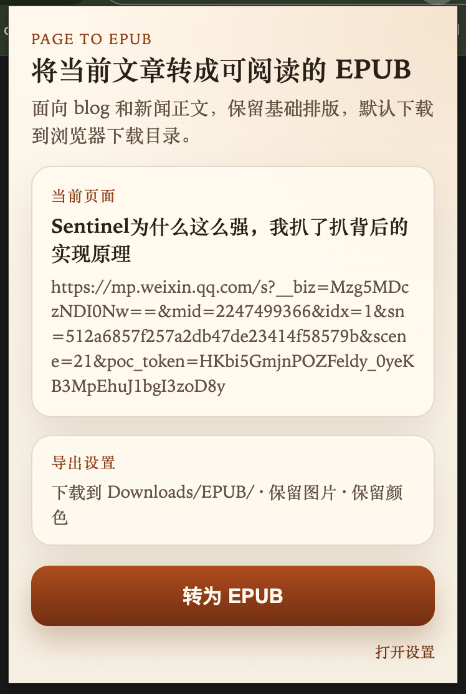
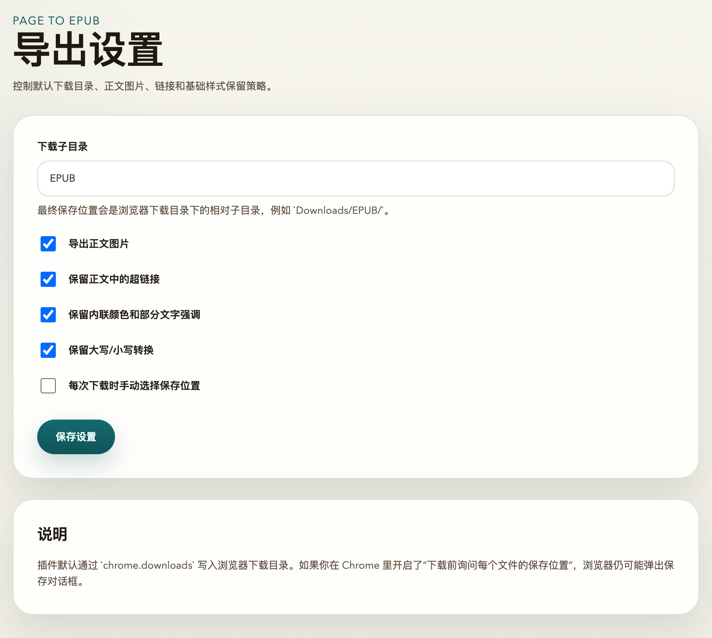
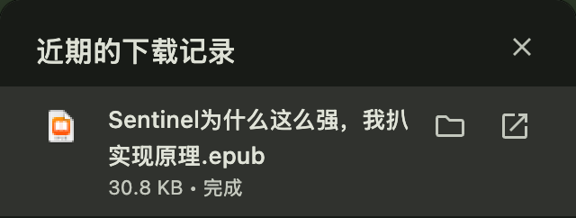

# 📖 Page to EPUB (Chrome Extension)

> 一键将网页文章转化为精美的 EPUB 电子书。

[](https://developer.chrome.com/docs/extensions/mv3/intro/)
[](LICENSE)

**Page to EPUB** 是一款基于 Chrome MV3 标准开发的浏览器插件，专为阅读爱好者设计。它可以智能提取网页中的正文内容，过滤冗余广告和导航，瞬间将其转化为适合在 Kindle、iPad 或其他电子阅读器上阅读的 EPUB 格式。

---

## ✨ 核心功能

- **🚀 一键转换**：在网页空白处右键点击即可启动转换，无需复杂操作。
- **🔗 批量背景抓取**：支持在链接上点击右键，直接在后台静默抓取链接内容并生成 EPUB。
- **🧠 智能正文提取**：集成 Mozilla Readability 引擎，精准识别文章主体，自动剔除侧边栏、广告、导航栏等杂质。
- **🖼️ 完美格式保留**：完整保留标题、段落、引用、代码块、表格、图片以及基础文字样式。
- **📁 自动化整理**：默认将生成的电子书保存至下载目录下的 `EPUB/` 文件夹，让您的书库井然有序。

## 📸 效果演示

### 1. 智能导出
在网页上点击右键，一键将正文提取并导出为 EPUB 电子书。


### 2. 导出设置
支持多种自定义配置，确保生成的电子书符合您的阅读习惯。


### 3. 下载完成
生成的 EPUB 文件会自动整理并保存到浏览器的下载目录中。


---

## 🛠️ 安装指南

### 方式 A：直接安装（推荐）
如果您已经拥有 `dist` 目录：
1. 打开 Chrome 浏览器，访问 `chrome://extensions/`。
2. 开启右上角的 **“开发者模式” (Developer mode)**。
3. 点击左上角的 **“加载已解压的扩展程序” (Load unpacked)**。
4. 在弹出的对话框中选择本项目根目录下的 `dist/` 文件夹。

### 方式 B：从源码编译
如果您想自行构建：
```bash
# 克隆仓库
git clone https://github.com/austincao/chrome-epub.git
cd chrome-epub

# 安装依赖
npm install

# 运行构建
npm run build
```
构建完成后，按照“方式 A”加载生成的 `dist` 目录即可。

---

## 📖 使用说明

1. **当前页转换**：在文章页面任何空白处点击**右键**，选择菜单中的 **“转为 EPUB”**。
2. **链接转换**：在文章列表页，对感兴趣的**文章链接**点击**右键**，选择 **“转为 EPUB”**，插件将在后台完成抓取，不干扰当前浏览。
3. **插件菜单**：点击浏览器右上角的插件图标，在弹出的窗口中也可以点击 **“转为 EPUB”** 按钮。

---

## ⚙️ 常见问题与限制

- **支持范围**：目前仅支持 `http://` 和 `https://` 协议的网页。
- **动态内容**：对于需要深度登录可见、防盗链严格或完全由脚本动态渲染的页面，可能存在提取不完整的情况。
- **保存位置**：若您的 Chrome 设置了“下载前询问每个文件的保存位置”，转换完成后仍会弹出系统保存窗口。

---

## 🤝 贡献与反馈

如果您在使用过程中遇到问题，或者有更好的改进建议，欢迎提交 [Issue](https://github.com/austincao/chrome-epub/issues) 或发起 [Pull Request](https://github.com/austincao/chrome-epub/pulls)。

---

**Page to EPUB** - 让网页阅读回归本质。
